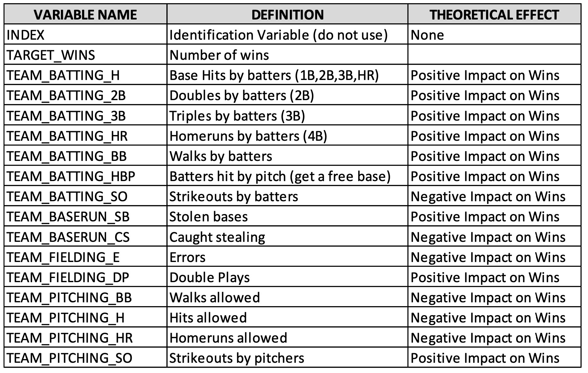

```{r setup, include=FALSE}

knitr::opts_chunk$set(echo = TRUE, result = 'asis', message=TRUE, warning=TRUE)
rm(list=ls())

```


```{r libraries}

library(skimr)
library(summarytools)
library(explore)
library(GGally)
library(corrplot)
library(dplyr)
library(tidyr)
library(MASS)
library(regclass)
library(campfin)
library(reshape2)
library(stringr)

```


```{r global, echo=FALSE}

configFile <- list(
                  fileNameTrain = './inst/data/moneyball-training-data.csv',
                  fileNameTest = './inst/data/moneyball-evaluation-data.csv'
              )


```


# Overview
The data-driven approach to sports management has gained significant traction over the years. In baseball, Sabermetrics has replaced instinct and gut feelings. Managers/coaches can optimize decisions, and interested parties can be predicted outcomes through careful analysis of the numbers. This assignment uses historic team statistics to forecast the number of team wins in a particular year. 

The following table is a short description of the data set used for this analysis.
{height=640px width=480px}


## Assignment 1

In this homework assignment, you will explore, analyze and model a data set containing approximately 2200 records. Each record represents a professional baseball team from the years 1871 to 2006 inclusive. Each record has the performance of the team for the given year, with all of the statistics adjusted to match the performance of a 162 game season.

Your objective is to build a multiple linear regression model on the training data to predict the number of wins for the team. You can only use the variables given to you (or variables that you derive from the variables provided)

## Deliverables:
- A write-up submitted in PDF format. Your write-up should have four sections. Each one is described below. You may assume you are addressing me as a fellow data scientist, so do not need to shy away from technical details.
- Assigned predictions (the number of wins for the team) for the evaluation data set.
- Include your R statistical programming code in an Appendix.


# 1. DATA EXPLORATION (25 Points)
Describe the size and the variables in the moneyball training data set. Consider that too much detail will cause a manager to lose interest while too little detail will make the manager consider that you aren’t doing your job. Some suggestions are given below. Please do NOT treat this as a check list of things to do to complete the assignment. You should have your own thoughts on what to tell the boss. These are just ideas.
a. Mean / Standard Deviation / Median
b. Bar Chart or Box Plot of the data
c. Is the data correlated to the target variable (or to other variables?)
d. Are any of the variables missing and need to be imputed “fixed”?


```{r load training data}

trainOrig_df <- read.csv(configFile$fileNameTrain)
train_df <- trainOrig_df %>% dplyr::select(-c('INDEX'))

columnNames <- names(train_df)
columnNames <- str_replace(columnNames, "TEAM_BATTING", "BAT")
columnNames <- str_replace(columnNames, "TEAM_PITCHING", "PITCH")
columnNames <- str_replace(columnNames, "TEAM_FIELDING", "FIELD")
columnNames <- str_replace(columnNames, "TEAM_BASERUN", "BASE")

names(train_df) <- columnNames
```


The data set has missing values across several variables, with only 191 complete records available. With sports statistics spanning over 100 years of league history, missing data can be expected. 


```{r}
st_options(
  dfSummary.custom.2 = 
    expression(
      paste(
        "Q1 - Q3 :",
        round(
          quantile(column_data, probs = .25, type = 2, 
                   names = FALSE, na.rm = TRUE), digits = 1
        ), " - ",
        round(
          quantile(column_data, probs = .75, type = 2, 
                   names = FALSE, na.rm = TRUE), digits = 1
        )
      )
    )
)

#st_options('round.digits') 
#st_options(style = 'rmarkdown') 


view(dfSummary(train_df,
               plain.ascii  = FALSE,
               style        = "grid"
               ),
     method = "browser"
     )


print(
  dfSummary(train_df, 
            varnumbers   = TRUE,
            na.col       = FALSE,
            style        = "grid",
            plain.ascii  = FALSE,
            freq.silent  = TRUE,
            headings     = TRUE,
            graph.magnif = .8,
            tmp.img.dir  = "/tmp"),
  method = "viewer"
)

```


```{r}

m_df <- melt(train_df)
m_df %>% ggplot(aes(x= value)) + 
    geom_density(fill='gray') + facet_wrap(~variable, scales = 'free') 


m_df %>% ggplot(aes(x = value)) +
  geom_boxplot(outlier.color = 'red', outlier.shape = 1) +
  #geom_jitter(width = 0.2) +
  #stat_boxplot(coef = 1.5) +
  facet_wrap(vars(variable),scales = "free", ncol = 4)
  


# 
# ggplot(stack(train_df), aes(x = ind, y = values)) + 
#   geom_boxplot() +
#   coord_cartesian(ylim = c(0, 1000)) +
#   theme(legend.position="none") +
#   theme(axis.text.x=element_text(angle=45, hjust=1)) + 
#   theme(panel.background = element_rect(fill = 'grey'))


```


```{r,  message=FALSE}


M <- cor(train_df)
M[(M < 0.2) & (M > -0.2)] <- 0
corrplot(M, method = 'number')

train_df %>% ggcorr(
    nbreaks = 10,
    label = TRUE,
    label_size = 4,
    #geom = "circle",
   color = "grey50")


columnNames <- c('TARGET_WINS','BAT_H','BAT_2B','BAT_3B','BAT_HR',
                  'BAT_BB','PITCH_H','PITCH_HR','PITCH_BB','FIELD_E')

train_df %>% dplyr::select(columnNames) %>% pairs(panel = panel.smooth, gap=0.5)


# columnNames <- names(train_df) 
# columnNames <- columnNames[ !columnNames %in% c('TEAM_BATTING_SO','TEAM_BASERUN_SB','TEAM_BASERUN_CS','TEAM_BATTING_HBP',
#                                                 'TEAM_PITCHING_SO','TEAM_PITCHING_SO')]

# columnNames <- c('TARGET_WINS','BAT_H','BAT_2B','BAT_3B','BAT_HR',
#                  'BAT_BB','PITCH_H','PITCH_HR','PITCH_BB','FIELD_E')
# 
# 
# train_df %>% drop_na() %>% ggpairs(columns = columnNames, 
#                       title = "Money Ball", 
#                       upper = list(continuous = wrap("cor", size = 3)),
#                       lower = list(continuous = wrap("smooth", alpha = 0.3,size = 0.1)))

```


```{r}

ggplot(train_df, aes(x=BAT_HR, y=PITCH_HR, color=TARGET_WINS)) + 
  scale_colour_gradient(low = 'gray', high = 'blue') + 
  geom_point()

ggplot(train_df, aes(x=FIELD_E, y=PITCH_H, color=TARGET_WINS)) + 
  scale_colour_gradient(low = 'gray', high = 'blue') + 
  geom_point()

ggplot(train_df, aes(x=FIELD_E, y=BAT_BB, color=TARGET_WINS)) + 
  scale_colour_gradient(low = 'gray', high = 'blue') + 
  geom_point()

ggplot(train_df, aes(x=BAT_3B, y=BAT_HR, color=TARGET_WINS)) + 
  scale_colour_gradient(low = 'gray', high = 'blue') + 
  geom_point()


#names(train_df)

```


Target Value - TARGET_WINS
Since the early 1960s, the schedule of both leagues of Major League Baseball has been 162 games long, and before that it was 154 games long. With such a large schedule, it is practically impossible for a team to finish with a winless season. The sabermetric baseball statistic Wins Above Replacement is calculated on the premise that even a team consisting entirely of replacement-level players, (i.e., a player that could be "replaced" by a call-up from the minor leagues without any significant statistical difference) is expected to win a baseline minimum number of games (typically 40–50, depending primarily on the caliber of the team's division) per 162-game season.

(minimum 120 games) and for all eras, finishing at 20–134 (.130 percentage)
116 games, which remains tied with the '01 Mariners for most ever, yet the Cubs did so in a 152-game schedule, making their . 763 win percentage the highest on record (since 1900).

https://champsorchumps.us/records/worst-mlb-regular-season-records#tab-win-percentage

Consider dropping teams with less than 20 wins and over 130


Missing Values
TEAM_BATTING_HBP (91.6%) of the values are missing
TEAM_BASERUN_CS (33.9%) of the values are missing


Outlier
TEAM_BATTING_H
TEAM_BATTING_3B
TEAM_BASERUN_SB 
TEAM_BASERUN_CS - might delete

TEAM_PITCHING_H
TEAM_PITCHING_BB
TEAM_PITCHING_SO
TEAM_PITCHING_E


BiModal Data


TEAM_BATTING_HR
TEAM_BATTING_SO
TEAM_PITCHING_HR


The original dataset can updated to remove the NA data in 2 ways. Both approaches will result in 2276 complete records.

- replace NA values with the average 
- drop columns with NA values


```{r}

# columns 
# na_columns <- c('TEAM_BATTING_SO', 'TEAM_BASERUN_SB', 'TEAM_BASERUN_CS', 'TEAM_BATTING_HBP', 'TEAM_PITCHING_SO', 'TEAM_FIELDING_DP')
# 
# trainFix_df <- train_df
# trainFix_df <- flag_na(trainFix_df, na_columns)
# trainFix_df <- trainFix_df %>% mutate(across(where(is.numeric), ~replace_na(., round(mean(., na.rm=TRUE)))))
# 
# trainOmit_df <- train_df %>% dplyr::select(-na_columns)
# 


```


#Check for outliers


# 2. DATA PREPARATION (25 Points)
Describe how you have transformed the data by changing the original variables or creating new variables. If you did transform the data or create new variables, discuss why you did this. Here are some possible transformations.

a. Fix missing values (maybe with a Mean or Median value)
b. Create flags to suggest if a variable was missing

- There are 2 variables with a substantial amount of missing data
BAT_HBP , BASE_CS

```{r}

train_df <- train_df %>% dplyr::select(-c(BAT_HBP,BASE_CS))

```


- Removed 0
- Changed NA to medians

```{r}

columnNames <- names(train_df)

train_df[train_df == 0] <- NA
train_df <- flag_na(train_df, columnNames)
train_df <- train_df %>% mutate(across(where(is.numeric), ~replace_na(., round(median(., na.rm=TRUE)))))

```


- BAT_HR and PITCH_HR have a 0.97 correlation

```{r}

t_df <- train_df %>% filter(na_flag)

```


```{r}

# Standard
t_df <- train_df %>% dplyr::select(-c(na_flag))
m_df <- melt(t_df)
m_df %>% ggplot(aes(x= value)) + 
    geom_density(fill='gray') + facet_wrap(~variable, scales = 'free') 

m_df %>% ggplot(aes(x = value)) +
  geom_boxplot(outlier.color = 'red', outlier.shape = 1) +
  facet_wrap(vars(variable),scales = "free", ncol = 4)


# SQRT
trainSqrt_df <- sqrt(t_df)
m_df <- melt(trainSqrt_df)
m_df %>% ggplot(aes(x= value)) + 
    geom_density(fill='gray') + facet_wrap(~variable, scales = 'free') 

m_df %>% ggplot(aes(x = value)) +
  geom_boxplot(outlier.color = 'red', outlier.shape = 1) +
  facet_wrap(vars(variable),scales = "free", ncol = 4)


# Log
trainLog_df <- log(t_df)
m_df <- melt(trainLog_df)
m_df %>% ggplot(aes(x= value)) + 
    geom_density(fill='gray') + facet_wrap(~variable, scales = 'free') 


m_df %>% ggplot(aes(x = value)) +
  geom_boxplot(outlier.color = 'red', outlier.shape = 1) +
  facet_wrap(vars(variable),scales = "free", ncol = 4)


```


sqrt - 
log - BASE_SB, PITCH_H, PITCH_BB, PITCH_SO, FIELD_E, FIELD_E


```{r}

trainTsf_df <- train_df

trainTsf_df$BASE_SB <- log(train_df$BASE_SB)
trainTsf_df$PITCH_H <- log(train_df$PITCH_H)
trainTsf_df$PITCH_BB <- log(train_df$PITCH_BB)
trainTsf_df$PITCH_SO <- log(train_df$PITCH_SO)
trainTsf_df$FIELD_E <- log(train_df$FIELD_E)
trainTsf_df$FIELD_E <- log(train_df$FIELD_E)


m_df <- melt(trainTsf_df)
m_df %>% ggplot(aes(x= value)) + 
    geom_density(fill='gray') + facet_wrap(~variable, scales = 'free') 


m_df %>% ggplot(aes(x = value)) +
  geom_boxplot(outlier.color = 'red', outlier.shape = 1) +
  facet_wrap(vars(variable),scales = "free", ncol = 4)


```


```{r}


```


```{r}


bc$y^lambda

bc$x

```


```{r}

skim(train_df) %>% dplyr::select(skim_variable,n_missing)


```


c. Transform data by putting it into buckets
d. Mathematical transforms such as log or square root (or use Box-Cox)
e. Combine variables (such as ratios or adding or multiplying) to create new variables


# 3. BUILD MODELS (25 Points)
Using the training data set, build at least three different multiple linear regression models, using different variables (or the same variables with different transformations). Since we have not yet covered automated variable selection methods, you should select the variables manually (unless you previously learned Forward or Stepwise selection, etc.). Since you manually selected a variable for inclusion into the model or exclusion into the model, indicate why this was done.


The defa

```{r}

fit.full <- lm(TARGET_WINS ~ ., data=train_df)
summary.lm(fit.full)

fit.step <- stepAIC(fit.full, direction = "both", trace = FALSE)
summary.lm(fit.step)

```


```{r}

fitFix.full <- lm(TARGET_WINS ~ ., data=trainFix_df)
summary.lm(fitFix.full)


fitFix.step <- stepAIC(fitFix.full, direction = "both", trace = FALSE)
summary.lm(fitFix.step)

```


```{r}

fitOmit.full <- lm(TARGET_WINS ~ ., data=trainOmit_df)
summary.lm(fitOmit.full)


fitOmit.step <- stepAIC(fitOmit.full, direction = "both", trace = FALSE)
summary.lm(fitOmit.step)


```


Discuss the coefficients in the models, do they make sense? For example, if a team hits a lot of Home Runs, it would be reasonably expected that such a team would win more games. However, if the coefficient is negative (suggesting that the team would lose more games), then that needs to be discussed. Are you keeping the model even though it is counter intuitive? Why? The boss needs to know.


```{r}

summary.lm(fit.step)
#coef(fit.step)

fit0 <- update(fit.step, ~. -TEAM_BATTING_HBP) 
summary.lm(fit0)


```


# 4. SELECT MODELS (25 Points)
Decide on the criteria for selecting the best multiple linear regression model. Will you select a model with slightly worse performance if it makes more sense or is more parsimonious? Discuss why you selected your model.
For the multiple linear regression model, will you use a metric such as Adjusted R2, RMSE, etc.? Be sure to explain how you can make inferences from the model, discuss multi-collinearity issues (if any), and discuss other relevant model output. Using the training data set, evaluate the multiple linear regression model based on (a) mean squared error, (b) R2, (c) F-statistic, and (d) residual plots. Make predictions using the evaluation data set.


```{r}

fit.final <- fitFix.step
summary(fit.final)


par(mfrow=c(2,2))
plot(fit.final)

```

```{r}

anova(fit3, test= "F")

confint(fit3)


```


## Load testing dataset


```{r}

test_df <- read.csv(configFile$fileNameTest)
test_df <- test_df %>% dplyr::select(-c('INDEX'))
skim(test_df)

testFix_df <- test_df
testFix_df <- flag_na(testFix_df, na_columns)
testFix_df <- testFix_df %>% mutate(across(where(is.numeric), ~replace_na(., round(mean(., na.rm=TRUE)))))

```


```{r}

testFix_df$PREDICT_WINS <- predict(fit.final, newdata=testFix_df)


```

